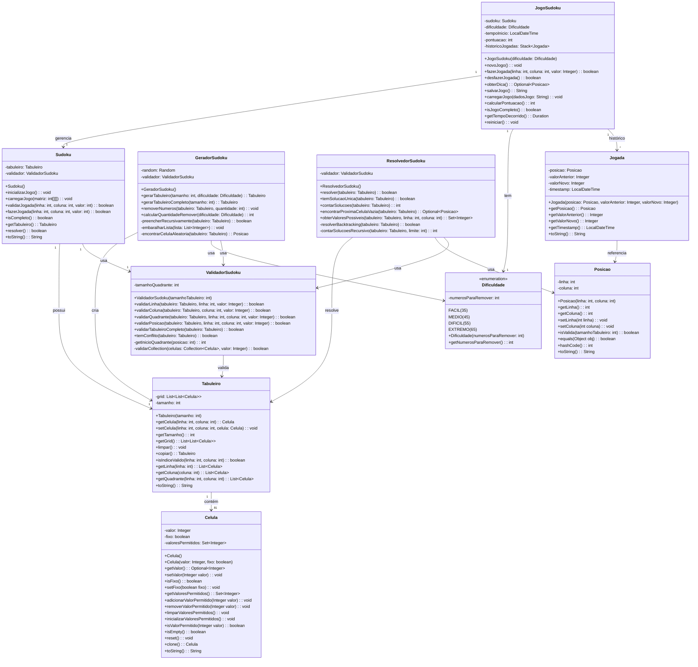

# Sudoku Java

Projeto de Sudoku em Java, com geração automática de tabuleiros, diferentes níveis de dificuldade, validação de jogadas, sistema de pontuação, dicas, histórico de jogadas (desfazer/refazer) e persistência do estado do jogo.

## Funcionalidades

- Geração de tabuleiros válidos de Sudoku (9x9) com solução única
- Níveis de dificuldade: Fácil, Médio, Difícil, Extremo
- Validação automática de jogadas
- Sistema de pontuação baseado em tempo, dificuldade e ações do jogador
- Dicas automáticas para ajudar o jogador
- Histórico de jogadas (desfazer última jogada)
- Salvar e carregar o estado do jogo (Base64)
- Reinício do jogo mantendo a dificuldade

## Estrutura do Projeto

- `matriz/`: Representação do tabuleiro, células e posições
    - `Tabuleiro.java`: Matriz de células do Sudoku
    - `Celula.java`: Representa cada célula do tabuleiro
    - `Posicao.java`: Representa uma posição (linha, coluna)
    - `Sudoku.java`: Lógica principal do jogo Sudoku
- `jogo/`: Lógica de controle do jogo
    - `Jogo.java`: Gerencia o estado do jogo, pontuação, histórico, dicas, salvar/carregar
    - `Jogada.java`: Representa uma jogada feita pelo jogador
    - `Gerador.java`: Gera tabuleiros válidos e aplica dificuldade
- `helpers/`: Utilitários de validação e resolução
    - `ValidadorHelper.java`: Valida regras do Sudoku
    - `ResolvedorHelper.java`: Resolve o Sudoku (backtracking)
- `enums/`
    - `Dificuldade.java`: Enumeração dos níveis de dificuldade
- `Main.java`: Exemplo de uso da API do jogo

## Exemplo de Uso

```java
import enums.Dificuldade;
import jogo.Jogo;

public class Main {
    public static void main(String[] args) {
        Jogo jogo = new Jogo(Dificuldade.MEDIO);
        jogo.novoJogo();
        System.out.println(jogo.getTabuleiro());

        jogo.fazerJogada(0, 1, 5);

        if (jogo.isJogoCompleto()) {
            System.out.println("Parabéns! Você completou o Sudoku!");
            System.out.println("Sua pontuação: " + jogo.calcularPontuacao());
        }

        String dadosSalvos = jogo.salvarJogo();
        // jogo.carregarJogo(dadosSalvos);
    }
}
```


# Mermaid

Para isso, o diagrama abaixo faz o desenho das classes:


